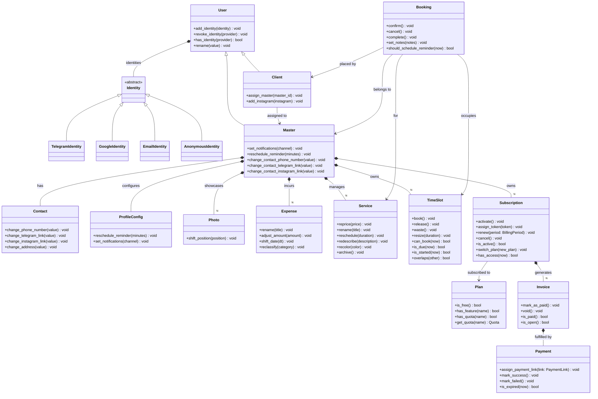
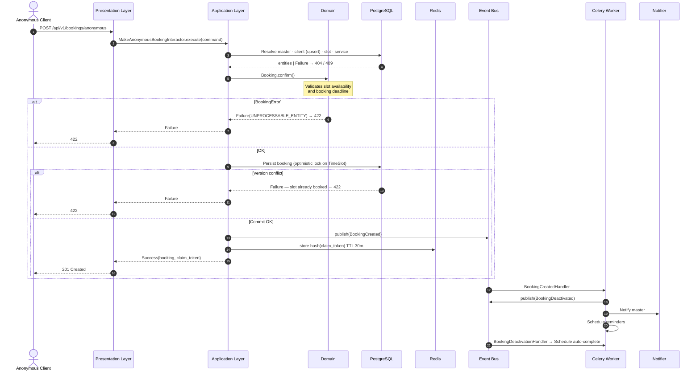

# bookeasy — Backend High-Level Design

> The source code is private (proprietary SaaS). This document provides an architectural overview and demonstrates the system design.
---

## Contents

1. [Description](#1-description)
2. [Technology Stack](#2-technology-stack)
3. [Architecture](#3-architecture)
4. [Project Structure](#4-project-structure)
5. [Domain Diagram](#5-domain-diagram)
6. [Anonymous Booking Flow](#6-anonymous-booking-flow)
7. [Architecture Decisions (ADR)](#7-architecture-decisions-adr)

---

## 1. Description

**BOOKEASY** is a SaaS platform for automating client appointments for beauty industry professionals. The system provides a professional with tools to manage their schedule, services, and client base, supporting online booking, automated reminders, and SaaS billing.

---

## 2. Technology Stack

| Category | Technology |
| --- | --- |
| Runtime | Python 3.12 |
| Web & Real-Time APIs | FastAPI, Socket.IO |
| Persistence & Storage | PostgreSQL, Cloudflare R2, SQLAlchemy 2.0 |
| Cache, Broker, Event Bus | Redis |
| Task Queue | Celery |
| Bot Framework | aiogram 3 |
| Payment Gateway | WayForPay |
| Observability | Sentry SDK |

---

## 3. Architecture

The project follows Clean Architecture and Domain-Driven Design (DDD).

```
┌────────────────────────────────────────┐
│          Presentation Layer            │
│   REST API (FastAPI) | Telegram Bot    │
│         WebSocket (Socket.IO)          │
└──────────────┬─────────────────────────┘
               │ 
┌──────────────▼─────────────────────────┐
│          Application Layer             │
│  Interactors · Event Handlers          │
│  Interfaces (Ports) · DTOs             │
└──────────────┬─────────────────────────┘
               │
┌──────────────▼─────────────────────────┐
│            Domain Layer                │
│  Entities · Value Objects · Events     │
│  Repository Interfaces · Exceptions    │
└────────────────────────────────────────┘
               ▲
┌──────────────┴─────────────────────────┐
│         Infrastructure Layer           │
│  PostgreSQL · Redis · Celery           │
│  WayForPay · Notifiers (TG/SMS/WS/PUSH)     │
│  transports/http · Google OAuth        │
│  JWT · Argon2 · Sentry                 │
└────────────────────────────────────────┘
               ▲
┌──────────────┴─────────────────────────┐
│           Bootstrap Layer              │
│  Dishka IoC · Event Subscriptions      │
│  ASGI App · Bot Runner · Celery Worker │
└────────────────────────────────────────┘
```

---

## 4. Project Structure

```text
src/
├── core/
├── domain/                    
│   ├── entities/
│   ├── value_objects/
│   ├── events/               
│   ├── exceptions/
│   ├── repositories/
│   └── enums/
├── application/    
│   ├── use_cases/                                  
│   ├── event_handlers/       
│   ├── services/              
│   ├── interfaces/            
│   └── dto/                   
├── infrastructure/            
│   ├── persistence/
│   │   ├── object_storage/
│   │   ├── postgres/          
│   │   └── redis/             
│   ├── messaging/
│   │   ├── event_bus/         
│   │   ├── notifiers/         
│   │   └── queues/celery/     
│   ├── transports/http/       
│   ├── billing/               
│   ├── security/      
│   ├── media/             
│   └── telemetry/             
├── presentation/              
│   ├── api/                   
│   └── bot/                   
└── bootstrap/                 
    ├── container/             
    ├── entrypoints/           
    ├── setup/
    └── subscriptions.py
```

---

## 5. Domain Diagram



---

## 6. Anonymous Booking Flow

A client without an account books an appointment via the master's public link.



The `claim_token` allows an anonymous client to view or cancel the booking within 30 minutes. A hash is stored in Redis — the original is not persisted.

---

## 7. Architecture Decisions (ADR)

### ADR-001: Unified Redis for Broker, Cache, Session, and Event Bus

- **Decision:** Use Redis as a single infra dependency for Celery broker, cache/session storage, and event bus transport.
- **Rationale:** Reduces operational surface and speeds delivery at the current product stage.
- **Trade-off:** Part of runtime messaging is non-durable by design; acceptable at this stage.

### ADR-002: Async-to-Sync Bridge for Celery Runtime

- **Decision:** Execute async interactors and async DI scope inside Celery via a long-lived event loop per worker process.
- **Rationale:** Keeps application/services async-first without rewriting worker integration to sync code.
- **Trade-off:** Additional lifecycle complexity in worker bootstrap/shutdown.

### ADR-003: Booking Consistency via Optimistic Concurrency on Time Slots

- **Decision:** Enforce slot state transitions through optimistic locking (`version`) during persistence.
- **Rationale:** Prevents double booking under concurrent writes while preserving throughput.
- **Trade-off:** Conflict handling is pushed to application flow (`422`/retry paths).

### ADR-004: Ephemeral Anonymous Claim Token (Hashed + TTL)

- **Decision:** Store only hashed anonymous claim tokens in Redis with strict TTL.
- **Rationale:** Enables temporary ownership/cancel flow without persisting raw bearer tokens.
- **Trade-off:** Claim is intentionally short-lived and non-recoverable after expiration.

### ADR-005: Best-Effort Internal Event Handling with Cross-Process Dedup

- **Decision:** Use Redis Pub/Sub for internal events with deduplication guard by `event_id`.
- **Rationale:** Lightweight event propagation between app processes and worker flows.
- **Trade-off:** Best-effort / at-most-once delivery semantics (no replay log); consumers must stay idempotent and tolerant to delivery timing.

### ADR-006: Single-Use Ticket Pattern for WebSocket Authentication

- **Decision:** Authenticate WebSocket connections via short-lived single-use tickets with TTL requested via `POST /api/v1/auth/ws-ticket` and consumed atomically (`GETDEL`) in Redis during handshake.
- **Rationale:** Reuses the existing HTTP authentication and permission pipeline, avoiding duplicated auth logic in the WebSocket transport.
- **Trade-off:** Requires an initial HTTP POST roundtrip before opening the socket connection.
